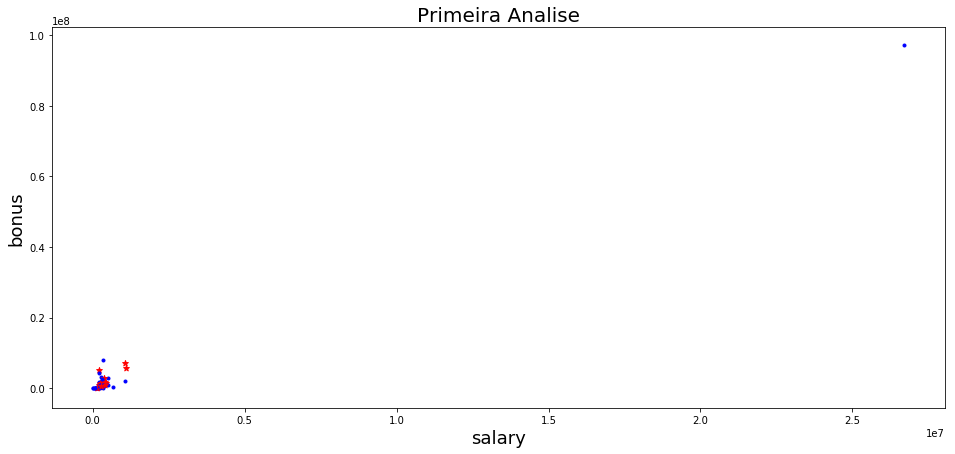
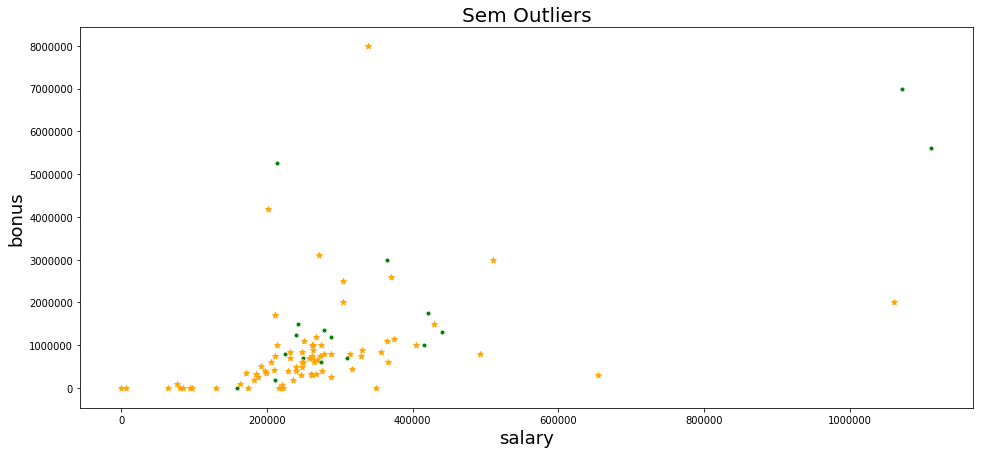
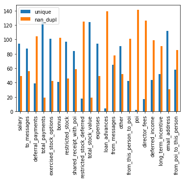
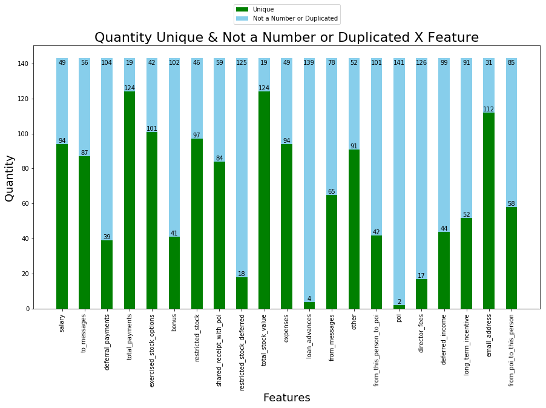

### Nanodegree - Fundamentos de Data Science II - Projeto 4 de 4 (UDACITY)


#### Projeto/Necessidade de negócio: 
- Def_Proj - Identificar fraude no Email da Enron.pdf

#### Entrega: 
- Report - Identificar fraude no Email da Enron.html
- poi_id.ipynb

#### Avaliação do cliente:
 - Udacity Reviews.pdf 
 - Udacity Code Reviews.pdf 
 
#
#
# 

## Projeto Final - DS2

### Import


```python
import sys
import pickle
import pandas as pd
import numpy as np
import warnings
import matplotlib.pyplot as plt
sys.path.append("../tools/")
warnings.filterwarnings("ignore")
```


```python
from sklearn.pipeline import Pipeline
from sklearn import preprocessing
from sklearn.decomposition import PCA
from sklearn.model_selection import GridSearchCV,train_test_split,\
                                    StratifiedShuffleSplit
from sklearn.tree import DecisionTreeClassifier
from sklearn.feature_selection import SelectKBest
from sklearn.externals import joblib
from sklearn.linear_model import LogisticRegression
from sklearn.naive_bayes import GaussianNB
from sklearn.grid_search import GridSearchCV
from sklearn.cross_validation import StratifiedShuffleSplit, train_test_split
from sklearn.neighbors import KNeighborsClassifier
from sklearn.svm import SVC
from sklearn.metrics import accuracy_score
from sklearn.preprocessing import MinMaxScaler
from sklearn.ensemble import RandomForestClassifier, AdaBoostClassifier
```


```python
from time import time
from feature_format import featureFormat, targetFeatureSplit
from tester import dump_classifier_and_data, test_classifier
scaler = MinMaxScaler()
```

### Funções


```python
def monta_grafico(feat_x, feat_y, titulo, dicionario, cor):
    # Criar um grafico scatter das fetures passadas no parametro
    features = ['poi', feat_x, feat_y]
    data = featureFormat(dicionario, features)
    
    plt.figure(figsize=(16,7))
    
    for point in data:
        x = point[1]
        y = point[2]
        if point[0]:
            if cor == 1:
                plt.scatter(x, y, color="red", marker="*")
            else:
                plt.scatter(x, y, color="green", marker=".")
        else:
            if cor == 1:
                plt.scatter(x, y, color='blue', marker=".")
            else:
                plt.scatter(x, y, color="orange", marker="*")
                
    
    plt.title(titulo, fontsize=20)
    plt.xlabel(feat_x, fontsize=18)
    plt.ylabel(feat_y, fontsize=18)    
    pic = feat_x + feat_y + '.png'
    plt.savefig(pic, transparent=True)
    plt.show()
    

def monta_feature(features_list):
    features_list = ['poi',
                 'salary',
                 'deferral_payments',
                 'total_payments',
                 'loan_advances',
                 'bonus',
                 'restricted_stock_deferred',
                 'deferred_income',
                 'total_stock_value',
                 'expenses',
                 'exercised_stock_options',
                 'other',
                 'long_term_incentive',
                 'restricted_stock',
                 'director_fees',
                 'to_messages',                
                 'from_poi_to_this_person',
                 'from_messages',
                 'from_this_person_to_poi',
                 'shared_receipt_with_poi']
    return features_list
    
def nova_feature(dataset, features_list):
    nova_feature = ["fraction_from_poi_email", "fraction_to_poi_email"]
    num_features = ["from_poi_to_this_person", "from_this_person_to_poi"]
    den_features = ["to_messages", "from_messages"]

    for x in dataset:
        data = dataset[x]

        for i, feature in enumerate(nova_feature):
            if data["poi"]:
                data[feature] = 'NaN'
            else:
                message_poi = data[num_features[i]]
                messages_all = data[den_features[i]]
                fracao_messages = calcula_fracao(message_poi, messages_all)
                data[feature] = fracao_messages

    return features_list + nova_feature


def testa_nova_feature(dataset, x, nova_feature):
    num_features = ["from_poi_to_this_person", "from_this_person_to_poi"]
    den_features = ["to_messages", "from_messages"]
    
    print x, "\n- {} = {:.4f} ({} / {})\n- {} = {:.4f} ({} / {})\n".format(nova_feature[0],dataset[x][nova_feature[0]],dataset[x][num_features[0]],dataset[x][den_features[0]],nova_feature[1], dataset[x][nova_feature[1]],dataset[x][num_features[1]],dataset[x][den_features[1]])
  
    
def pipeline_classificador(tipo, kbest, f_list):
    # Contruir um pipeline e tune parameters via GridSearchCV

    data = featureFormat(my_dataset, f_list, sort_keys=True)
    labels, features = targetFeatureSplit(data)

    # Usando o stratified shuffle split cross validation devido ao tamanho dos conjuntos de dados
    stratified_split_cross_validation = StratifiedShuffleSplit(labels, 500, test_size=0.3, random_state=42)

    # Build pipeline
    kbest = SelectKBest(k=kbest)
    scaler = MinMaxScaler()
    classifier = escolher_classificador(tipo)
    pipeline = Pipeline(steps=[('minmax_scaler', scaler), ('feature_selection', kbest), (tipo, classifier)])

    # Set parameters for random forest
    parameters = []
    if tipo == 'randomforest':
        parameters = dict(randomforest__n_estimators=[25, 50],
                          randomforest__min_samples_split=[2, 3, 4],
                          randomforest__criterion=['gini', 'entropy'])
    if tipo == 'logistic_regression':
        parameters = dict(logistic_regression__class_weight=['balanced'],
                          logistic_regression__solver=['liblinear'],
                          logistic_regression__C=range(1, 5),
                          logistic_regression__random_state=42)
    if tipo == 'decisiontree':
        parameters = dict(decisiontree__min_samples_leaf=range(1, 5),
                          decisiontree__max_depth=range(1, 5),
                          decisiontree__class_weight=['balanced'],
                          decisiontree__criterion=['gini', 'entropy'])

    # Get optimized parameters for F1-scoring metrics
    cv = GridSearchCV(pipeline, param_grid=parameters, scoring='f1', cv=stratified_split_cross_validation)
    t0 = time()
    cv.fit(features, labels)
    print 'Tuning Classifier: %r' % round(time() - t0, 3)

    return cv

def melhor_classificador(aux):
    # Função para escolher um tipo de classificador
    return {
        'randomforest': RandomForestClassifier(),
        'decisiontree': DecisionTreeClassifier(),
        'logistic_regression': LogisticRegression(),
        'gaussiannb': GaussianNB()
    }.get(aux)    

def calcula_fracao(message_poi, messages_all):
    calc_fracao = 0.    
    if message_poi != "NaN" and messages_all != "NaN":        
        calc_fracao = float(message_poi) / messages_all
    return calc_fracao

def sumariza_valores(dataset):
    df_list = []
    for key, y in dataset.items():
        df_list.append(y)
    
    df = pd.DataFrame(df_list, columns = dataset.items()[0][1].keys())

    for i in df.columns:
        df[i][df[i].apply(lambda i: True if str(i) == "NaN" else False)]=None
    
    df = df.convert_objects(convert_numeric=True)
    df.info()
    
def conta_poi(dataset):
    poi_count = 0
    for key, value in dataset.items():
        if value['poi']:
            poi_count += 1
    return poi_count

def accuracy(new_features,features_list):
    #Feature List
    features_list = monta_feature(features_list)
    if new_features == False:
        print features_list
        
    else:
        features_list = nova_feature(data_dict_woo, features_list)
        print ""
        print features_list
        print "Testando novos features adicionados:\n"
        testa_nova_feature(data_dict_woo, "DIETRICH JANET R", features_list[-2:])
        
    # Extraindo as features e os labels do conjunto de dados
    data = featureFormat(my_dataset, features_list, sort_keys = True)
    labels, features = targetFeatureSplit(data)    
        
    features_train, features_test, labels_train, labels_test = \
    train_test_split(features, labels, test_size=0.3, random_state=42)
    print ""
    
    # Criando Min/Max Scaler
    from sklearn import preprocessing
    scaler = preprocessing.MinMaxScaler()
    # Scale Features
    features = scaler.fit_transform(features)
    
    skbest = SelectKBest(k=10)  # try best value to fit
    sk_trans = skbest.fit_transform(features_train, labels_train)
    indices = skbest.get_support(True)
    
    print "="*10,"skbest.scores_","="*10
    print skbest.scores_
    print "="*10, "="*(len("skbest.scores_")-2),"="*10
    print ""
    
    print "="*10,"features - score","="*10
    for index in indices:
        print 'features: %s score: %f' % (features_list[index + 1], skbest.scores_[index])
        
    print "="*10, "="*(len('features: %s score: %f')-2),"="*10
    print ""
    
    #print "GaussianNB"
    # GaussianNB
    clf = GaussianNB()
    clf.fit(features_train, labels_train)
    prediction = clf.predict(features_test)
    print "Accuracy GaussianNB  = {:.5f}".format(accuracy_score(prediction, labels_test))
    
    #print "KNeighborsClassifier"
    # KNeighborsClassifier
    clf = KNeighborsClassifier()
    clf = KNeighborsClassifier(algorithm = 'auto',leaf_size = 20,n_neighbors = 3,weights = 'uniform')
    clf.fit(features_train, labels_train)
    prediction = clf.predict(features_test)
    print "Accuracy KNeighborsClassifier  = {:.5f}".format(accuracy_score(prediction, labels_test))
    
    #print "SVC"
    # SVC
    clf = SVC(kernel = 'linear',max_iter = 10000,random_state = 42)
    clf.fit(features_train, labels_train)
    prediction = clf.predict(features_test)
    print "Accuracy SVC = {:.5f}".format(accuracy_score(prediction, labels_test))
    
    #print "AdaBoostClassifier"
    clf = AdaBoostClassifier(DecisionTreeClassifier(max_depth=1, min_samples_leaf=2, class_weight='balanced'),
                             n_estimators=50, learning_rate=.8)
    clf.fit(features_train, labels_train)
    prediction = clf.predict(features_test)
    print "Accuracy AdaBoostClassifier = {:.5f}".format(accuracy_score(prediction, labels_test))
    
def adaboost_kbest(kbest_value, new_features,features_list):
    #Feature List
    features_list = monta_feature(features_list)
    if new_features == False:
        print "Default Features" 
#        print features_list 
        
    else:
        features_list = nova_feature(data_dict_woo, features_list)
        print "New Features"
#        print features_list
#        print "Testando novos features adicionados:\n"
#        testa_nova_feature(data_dict_woo, "DIETRICH JANET R", features_list[-2:])
        
    # Extraindo as features e os labels do conjunto de dados
    data = featureFormat(my_dataset, features_list, sort_keys = True)
    labels, features = targetFeatureSplit(data)    
        
    features_train, features_test, labels_train, labels_test = \
    train_test_split(features, labels, test_size=0.3, random_state=42)
    print ""
    
    # Criando Min/Max Scaler
    from sklearn import preprocessing
    scaler = preprocessing.MinMaxScaler()
    # Scale Features
    features = scaler.fit_transform(features)
    
    skbest = SelectKBest(k=kbest_value)  # try best value to fit
    sk_trans = skbest.fit_transform(features_train, labels_train)
    indices = skbest.get_support(True)
        
    clf = AdaBoostClassifier(DecisionTreeClassifier(max_depth=1, min_samples_leaf=3, class_weight='balanced'),
                         n_estimators=50, learning_rate=.95)

    # Validate model precision, recall and F1-score
    test_classifier(clf, my_dataset, features_list)
    

```

### Task 1: Select what features you'll use.
- features_list is a list of strings, each of which is a feature name.
- The first feature must be "poi".


```python
features_list = []
features_list = monta_feature(features_list)
```


```python
print features_list
```

    ['poi', 'salary', 'deferral_payments', 'total_payments', 'loan_advances', 'bonus', 'restricted_stock_deferred', 'deferred_income', 'total_stock_value', 'expenses', 'exercised_stock_options', 'other', 'long_term_incentive', 'restricted_stock', 'director_fees', 'to_messages', 'from_poi_to_this_person', 'from_messages', 'from_this_person_to_poi', 'shared_receipt_with_poi']
    


```python
#Feature List
#features_list = ['poi',
#                 'salary',
#                 'deferral_payments',
#                 'total_payments',
#                 'loan_advances',
#                 'bonus',
#                 'restricted_stock_deferred',
#                 'deferred_income',
#                 'total_stock_value',
#                 'expenses',
#                 'exercised_stock_options',
#                 'other',
#                 'long_term_incentive',
#                 'restricted_stock',
#                 'director_fees',
#                 'to_messages',                
#                 'from_poi_to_this_person',
#                 'from_messages',
#                 'from_this_person_to_poi',
#                 'shared_receipt_with_poi'] # You will need to use more features
```


```python
# Carregando o conjunto de dados
with open("final_project_dataset.pkl", "r") as data_file:
#    data_dict = pickle.load(data_file)
    data_dict = pickle.load(open("final_project_dataset.pkl", "r"))
    
```


```python
print "\nQuantidade total de registros: {}\nQuantidade total de features: {}".format(len(data_dict), len(data_dict["HAUG DAVID L"])) 
print "Quantidade de POI's: {}".format(conta_poi(data_dict)) 
print "Quantidade de não POI's: {}".format(len(data_dict) - conta_poi(data_dict))
```

    
    Quantidade total de registros: 146
    Quantidade total de features: 21
    Quantidade de POI's: 18
    Quantidade de não POI's: 128
    


```python
df_enron = pd.DataFrame.from_dict(data_dict, orient = 'index')
```


```python
df_enron.head()
```


<div>
<style scoped>
    .dataframe tbody tr th:only-of-type {
        vertical-align: middle;
    }

    .dataframe tbody tr th {
        vertical-align: top;
    }

    .dataframe thead th {
        text-align: right;
    }
</style>
<table border="1" class="dataframe">
  <thead>
    <tr style="text-align: right;">
      <th></th>
      <th>salary</th>
      <th>to_messages</th>
      <th>deferral_payments</th>
      <th>total_payments</th>
      <th>exercised_stock_options</th>
      <th>bonus</th>
      <th>restricted_stock</th>
      <th>shared_receipt_with_poi</th>
      <th>restricted_stock_deferred</th>
      <th>total_stock_value</th>
      <th>...</th>
      <th>loan_advances</th>
      <th>from_messages</th>
      <th>other</th>
      <th>from_this_person_to_poi</th>
      <th>poi</th>
      <th>director_fees</th>
      <th>deferred_income</th>
      <th>long_term_incentive</th>
      <th>email_address</th>
      <th>from_poi_to_this_person</th>
    </tr>
  </thead>
  <tbody>
    <tr>
      <th>ALLEN PHILLIP K</th>
      <td>201955</td>
      <td>2902</td>
      <td>2869717</td>
      <td>4484442</td>
      <td>1729541</td>
      <td>4175000</td>
      <td>126027</td>
      <td>1407</td>
      <td>-126027</td>
      <td>1729541</td>
      <td>...</td>
      <td>NaN</td>
      <td>2195</td>
      <td>152</td>
      <td>65</td>
      <td>False</td>
      <td>NaN</td>
      <td>-3081055</td>
      <td>304805</td>
      <td>phillip.allen@enron.com</td>
      <td>47</td>
    </tr>
    <tr>
      <th>BADUM JAMES P</th>
      <td>NaN</td>
      <td>NaN</td>
      <td>178980</td>
      <td>182466</td>
      <td>257817</td>
      <td>NaN</td>
      <td>NaN</td>
      <td>NaN</td>
      <td>NaN</td>
      <td>257817</td>
      <td>...</td>
      <td>NaN</td>
      <td>NaN</td>
      <td>NaN</td>
      <td>NaN</td>
      <td>False</td>
      <td>NaN</td>
      <td>NaN</td>
      <td>NaN</td>
      <td>NaN</td>
      <td>NaN</td>
    </tr>
    <tr>
      <th>BANNANTINE JAMES M</th>
      <td>477</td>
      <td>566</td>
      <td>NaN</td>
      <td>916197</td>
      <td>4046157</td>
      <td>NaN</td>
      <td>1757552</td>
      <td>465</td>
      <td>-560222</td>
      <td>5243487</td>
      <td>...</td>
      <td>NaN</td>
      <td>29</td>
      <td>864523</td>
      <td>0</td>
      <td>False</td>
      <td>NaN</td>
      <td>-5104</td>
      <td>NaN</td>
      <td>james.bannantine@enron.com</td>
      <td>39</td>
    </tr>
    <tr>
      <th>BAXTER JOHN C</th>
      <td>267102</td>
      <td>NaN</td>
      <td>1295738</td>
      <td>5634343</td>
      <td>6680544</td>
      <td>1200000</td>
      <td>3942714</td>
      <td>NaN</td>
      <td>NaN</td>
      <td>10623258</td>
      <td>...</td>
      <td>NaN</td>
      <td>NaN</td>
      <td>2660303</td>
      <td>NaN</td>
      <td>False</td>
      <td>NaN</td>
      <td>-1386055</td>
      <td>1586055</td>
      <td>NaN</td>
      <td>NaN</td>
    </tr>
    <tr>
      <th>BAY FRANKLIN R</th>
      <td>239671</td>
      <td>NaN</td>
      <td>260455</td>
      <td>827696</td>
      <td>NaN</td>
      <td>400000</td>
      <td>145796</td>
      <td>NaN</td>
      <td>-82782</td>
      <td>63014</td>
      <td>...</td>
      <td>NaN</td>
      <td>NaN</td>
      <td>69</td>
      <td>NaN</td>
      <td>False</td>
      <td>NaN</td>
      <td>-201641</td>
      <td>NaN</td>
      <td>frank.bay@enron.com</td>
      <td>NaN</td>
    </tr>
  </tbody>
</table>
<p>5 rows × 21 columns</p>
</div>


```python
df_enron.sample(5)
```


<div>
<style scoped>
    .dataframe tbody tr th:only-of-type {
        vertical-align: middle;
    }

    .dataframe tbody tr th {
        vertical-align: top;
    }

    .dataframe thead th {
        text-align: right;
    }
</style>
<table border="1" class="dataframe">
  <thead>
    <tr style="text-align: right;">
      <th></th>
      <th>salary</th>
      <th>to_messages</th>
      <th>deferral_payments</th>
      <th>total_payments</th>
      <th>exercised_stock_options</th>
      <th>bonus</th>
      <th>restricted_stock</th>
      <th>shared_receipt_with_poi</th>
      <th>restricted_stock_deferred</th>
      <th>total_stock_value</th>
      <th>...</th>
      <th>loan_advances</th>
      <th>from_messages</th>
      <th>other</th>
      <th>from_this_person_to_poi</th>
      <th>poi</th>
      <th>director_fees</th>
      <th>deferred_income</th>
      <th>long_term_incentive</th>
      <th>email_address</th>
      <th>from_poi_to_this_person</th>
    </tr>
  </thead>
  <tbody>
    <tr>
      <th>SHERRIFF JOHN R</th>
      <td>428780</td>
      <td>3187</td>
      <td>NaN</td>
      <td>4335388</td>
      <td>1835558</td>
      <td>1500000</td>
      <td>1293424</td>
      <td>2103</td>
      <td>NaN</td>
      <td>3128982</td>
      <td>...</td>
      <td>NaN</td>
      <td>92</td>
      <td>1852186</td>
      <td>23</td>
      <td>False</td>
      <td>NaN</td>
      <td>NaN</td>
      <td>554422</td>
      <td>john.sherriff@enron.com</td>
      <td>28</td>
    </tr>
    <tr>
      <th>DERRICK JR. JAMES V</th>
      <td>492375</td>
      <td>2181</td>
      <td>NaN</td>
      <td>550981</td>
      <td>8831913</td>
      <td>800000</td>
      <td>1787380</td>
      <td>1401</td>
      <td>-1787380</td>
      <td>8831913</td>
      <td>...</td>
      <td>NaN</td>
      <td>909</td>
      <td>7482</td>
      <td>20</td>
      <td>False</td>
      <td>NaN</td>
      <td>-1284000</td>
      <td>484000</td>
      <td>james.derrick@enron.com</td>
      <td>64</td>
    </tr>
    <tr>
      <th>GLISAN JR BEN F</th>
      <td>274975</td>
      <td>873</td>
      <td>NaN</td>
      <td>1272284</td>
      <td>384728</td>
      <td>600000</td>
      <td>393818</td>
      <td>874</td>
      <td>NaN</td>
      <td>778546</td>
      <td>...</td>
      <td>NaN</td>
      <td>16</td>
      <td>200308</td>
      <td>6</td>
      <td>True</td>
      <td>NaN</td>
      <td>NaN</td>
      <td>71023</td>
      <td>ben.glisan@enron.com</td>
      <td>52</td>
    </tr>
    <tr>
      <th>FOY JOE</th>
      <td>NaN</td>
      <td>57</td>
      <td>181755</td>
      <td>181755</td>
      <td>343434</td>
      <td>NaN</td>
      <td>NaN</td>
      <td>2</td>
      <td>NaN</td>
      <td>343434</td>
      <td>...</td>
      <td>NaN</td>
      <td>13</td>
      <td>NaN</td>
      <td>0</td>
      <td>False</td>
      <td>NaN</td>
      <td>NaN</td>
      <td>NaN</td>
      <td>tracy.foy@enron.com</td>
      <td>0</td>
    </tr>
    <tr>
      <th>SCRIMSHAW MATTHEW</th>
      <td>NaN</td>
      <td>NaN</td>
      <td>NaN</td>
      <td>NaN</td>
      <td>759557</td>
      <td>NaN</td>
      <td>NaN</td>
      <td>NaN</td>
      <td>NaN</td>
      <td>759557</td>
      <td>...</td>
      <td>NaN</td>
      <td>NaN</td>
      <td>NaN</td>
      <td>NaN</td>
      <td>False</td>
      <td>NaN</td>
      <td>NaN</td>
      <td>NaN</td>
      <td>matthew.scrimshaw@enron.com</td>
      <td>NaN</td>
    </tr>
  </tbody>
</table>
<p>5 rows × 21 columns</p>
</div>


```python
df_enron.tail()
```


<div>
<style scoped>
    .dataframe tbody tr th:only-of-type {
        vertical-align: middle;
    }

    .dataframe tbody tr th {
        vertical-align: top;
    }

    .dataframe thead th {
        text-align: right;
    }
</style>
<table border="1" class="dataframe">
  <thead>
    <tr style="text-align: right;">
      <th></th>
      <th>salary</th>
      <th>to_messages</th>
      <th>deferral_payments</th>
      <th>total_payments</th>
      <th>exercised_stock_options</th>
      <th>bonus</th>
      <th>restricted_stock</th>
      <th>shared_receipt_with_poi</th>
      <th>restricted_stock_deferred</th>
      <th>total_stock_value</th>
      <th>...</th>
      <th>loan_advances</th>
      <th>from_messages</th>
      <th>other</th>
      <th>from_this_person_to_poi</th>
      <th>poi</th>
      <th>director_fees</th>
      <th>deferred_income</th>
      <th>long_term_incentive</th>
      <th>email_address</th>
      <th>from_poi_to_this_person</th>
    </tr>
  </thead>
  <tbody>
    <tr>
      <th>WINOKUR JR. HERBERT S</th>
      <td>NaN</td>
      <td>NaN</td>
      <td>NaN</td>
      <td>84992</td>
      <td>NaN</td>
      <td>NaN</td>
      <td>NaN</td>
      <td>NaN</td>
      <td>NaN</td>
      <td>NaN</td>
      <td>...</td>
      <td>NaN</td>
      <td>NaN</td>
      <td>NaN</td>
      <td>NaN</td>
      <td>False</td>
      <td>108579</td>
      <td>-25000</td>
      <td>NaN</td>
      <td>NaN</td>
      <td>NaN</td>
    </tr>
    <tr>
      <th>WODRASKA JOHN</th>
      <td>NaN</td>
      <td>NaN</td>
      <td>NaN</td>
      <td>189583</td>
      <td>NaN</td>
      <td>NaN</td>
      <td>NaN</td>
      <td>NaN</td>
      <td>NaN</td>
      <td>NaN</td>
      <td>...</td>
      <td>NaN</td>
      <td>NaN</td>
      <td>189583</td>
      <td>NaN</td>
      <td>False</td>
      <td>NaN</td>
      <td>NaN</td>
      <td>NaN</td>
      <td>john.wodraska@enron.com</td>
      <td>NaN</td>
    </tr>
    <tr>
      <th>WROBEL BRUCE</th>
      <td>NaN</td>
      <td>NaN</td>
      <td>NaN</td>
      <td>NaN</td>
      <td>139130</td>
      <td>NaN</td>
      <td>NaN</td>
      <td>NaN</td>
      <td>NaN</td>
      <td>139130</td>
      <td>...</td>
      <td>NaN</td>
      <td>NaN</td>
      <td>NaN</td>
      <td>NaN</td>
      <td>False</td>
      <td>NaN</td>
      <td>NaN</td>
      <td>NaN</td>
      <td>NaN</td>
      <td>NaN</td>
    </tr>
    <tr>
      <th>YEAGER F SCOTT</th>
      <td>158403</td>
      <td>NaN</td>
      <td>NaN</td>
      <td>360300</td>
      <td>8308552</td>
      <td>NaN</td>
      <td>3576206</td>
      <td>NaN</td>
      <td>NaN</td>
      <td>11884758</td>
      <td>...</td>
      <td>NaN</td>
      <td>NaN</td>
      <td>147950</td>
      <td>NaN</td>
      <td>True</td>
      <td>NaN</td>
      <td>NaN</td>
      <td>NaN</td>
      <td>scott.yeager@enron.com</td>
      <td>NaN</td>
    </tr>
    <tr>
      <th>YEAP SOON</th>
      <td>NaN</td>
      <td>NaN</td>
      <td>NaN</td>
      <td>55097</td>
      <td>192758</td>
      <td>NaN</td>
      <td>NaN</td>
      <td>NaN</td>
      <td>NaN</td>
      <td>192758</td>
      <td>...</td>
      <td>NaN</td>
      <td>NaN</td>
      <td>NaN</td>
      <td>NaN</td>
      <td>False</td>
      <td>NaN</td>
      <td>NaN</td>
      <td>NaN</td>
      <td>NaN</td>
      <td>NaN</td>
    </tr>
  </tbody>
</table>
<p>5 rows × 21 columns</p>
</div>


```python
df_enron.describe().transpose()
```


<div>
<style scoped>
    .dataframe tbody tr th:only-of-type {
        vertical-align: middle;
    }

    .dataframe tbody tr th {
        vertical-align: top;
    }

    .dataframe thead th {
        text-align: right;
    }
</style>
<table border="1" class="dataframe">
  <thead>
    <tr style="text-align: right;">
      <th></th>
      <th>count</th>
      <th>unique</th>
      <th>top</th>
      <th>freq</th>
    </tr>
  </thead>
  <tbody>
    <tr>
      <th>salary</th>
      <td>146</td>
      <td>95</td>
      <td>NaN</td>
      <td>51</td>
    </tr>
    <tr>
      <th>to_messages</th>
      <td>146</td>
      <td>87</td>
      <td>NaN</td>
      <td>60</td>
    </tr>
    <tr>
      <th>deferral_payments</th>
      <td>146</td>
      <td>40</td>
      <td>NaN</td>
      <td>107</td>
    </tr>
    <tr>
      <th>total_payments</th>
      <td>146</td>
      <td>126</td>
      <td>NaN</td>
      <td>21</td>
    </tr>
    <tr>
      <th>exercised_stock_options</th>
      <td>146</td>
      <td>102</td>
      <td>NaN</td>
      <td>44</td>
    </tr>
    <tr>
      <th>bonus</th>
      <td>146</td>
      <td>42</td>
      <td>NaN</td>
      <td>64</td>
    </tr>
    <tr>
      <th>restricted_stock</th>
      <td>146</td>
      <td>98</td>
      <td>NaN</td>
      <td>36</td>
    </tr>
    <tr>
      <th>shared_receipt_with_poi</th>
      <td>146</td>
      <td>84</td>
      <td>NaN</td>
      <td>60</td>
    </tr>
    <tr>
      <th>restricted_stock_deferred</th>
      <td>146</td>
      <td>19</td>
      <td>NaN</td>
      <td>128</td>
    </tr>
    <tr>
      <th>total_stock_value</th>
      <td>146</td>
      <td>125</td>
      <td>NaN</td>
      <td>20</td>
    </tr>
    <tr>
      <th>expenses</th>
      <td>146</td>
      <td>95</td>
      <td>NaN</td>
      <td>51</td>
    </tr>
    <tr>
      <th>loan_advances</th>
      <td>146</td>
      <td>5</td>
      <td>NaN</td>
      <td>142</td>
    </tr>
    <tr>
      <th>from_messages</th>
      <td>146</td>
      <td>65</td>
      <td>NaN</td>
      <td>60</td>
    </tr>
    <tr>
      <th>other</th>
      <td>146</td>
      <td>93</td>
      <td>NaN</td>
      <td>53</td>
    </tr>
    <tr>
      <th>from_this_person_to_poi</th>
      <td>146</td>
      <td>42</td>
      <td>NaN</td>
      <td>60</td>
    </tr>
    <tr>
      <th>poi</th>
      <td>146</td>
      <td>2</td>
      <td>False</td>
      <td>128</td>
    </tr>
    <tr>
      <th>director_fees</th>
      <td>146</td>
      <td>18</td>
      <td>NaN</td>
      <td>129</td>
    </tr>
    <tr>
      <th>deferred_income</th>
      <td>146</td>
      <td>45</td>
      <td>NaN</td>
      <td>97</td>
    </tr>
    <tr>
      <th>long_term_incentive</th>
      <td>146</td>
      <td>53</td>
      <td>NaN</td>
      <td>80</td>
    </tr>
    <tr>
      <th>email_address</th>
      <td>146</td>
      <td>112</td>
      <td>NaN</td>
      <td>35</td>
    </tr>
    <tr>
      <th>from_poi_to_this_person</th>
      <td>146</td>
      <td>58</td>
      <td>NaN</td>
      <td>60</td>
    </tr>
  </tbody>
</table>
</div>


```python
monta_grafico("salary", "bonus", "Primeira Analise",data_dict,1)
```





### Analise Exploratória
- Visulamente já é possível ver que muitas informações estão faltando
- Isso fica bem evidente quando analisamos por código
- Foi identificado o outliers TOTAL, que nos levou a investigar possíveis pois que não fossem pessoas


```python
print "Dados: HAUG DAVID L:\n\n{}".format(data_dict["TOTAL"])
print "Dados: LOCKHART EUGENE E:\n\n{}".format(data_dict["LOCKHART EUGENE E"])
print "Dados: THE TRAVEL AGENCY IN THE PARK:\n\n{}".format(data_dict["THE TRAVEL AGENCY IN THE PARK"])
```

    Dados: HAUG DAVID L:
    
    {'salary': 26704229, 'to_messages': 'NaN', 'deferral_payments': 32083396, 'total_payments': 309886585, 'exercised_stock_options': 311764000, 'bonus': 97343619, 'restricted_stock': 130322299, 'shared_receipt_with_poi': 'NaN', 'restricted_stock_deferred': -7576788, 'total_stock_value': 434509511, 'expenses': 5235198, 'loan_advances': 83925000, 'from_messages': 'NaN', 'other': 42667589, 'from_this_person_to_poi': 'NaN', 'poi': False, 'director_fees': 1398517, 'deferred_income': -27992891, 'long_term_incentive': 48521928, 'email_address': 'NaN', 'from_poi_to_this_person': 'NaN'}
    Dados: LOCKHART EUGENE E:
    
    {'salary': 'NaN', 'to_messages': 'NaN', 'deferral_payments': 'NaN', 'total_payments': 'NaN', 'exercised_stock_options': 'NaN', 'bonus': 'NaN', 'restricted_stock': 'NaN', 'shared_receipt_with_poi': 'NaN', 'restricted_stock_deferred': 'NaN', 'total_stock_value': 'NaN', 'expenses': 'NaN', 'loan_advances': 'NaN', 'from_messages': 'NaN', 'other': 'NaN', 'from_this_person_to_poi': 'NaN', 'poi': False, 'director_fees': 'NaN', 'deferred_income': 'NaN', 'long_term_incentive': 'NaN', 'email_address': 'NaN', 'from_poi_to_this_person': 'NaN'}
    Dados: THE TRAVEL AGENCY IN THE PARK:
    
    {'salary': 'NaN', 'to_messages': 'NaN', 'deferral_payments': 'NaN', 'total_payments': 362096, 'exercised_stock_options': 'NaN', 'bonus': 'NaN', 'restricted_stock': 'NaN', 'shared_receipt_with_poi': 'NaN', 'restricted_stock_deferred': 'NaN', 'total_stock_value': 'NaN', 'expenses': 'NaN', 'loan_advances': 'NaN', 'from_messages': 'NaN', 'other': 362096, 'from_this_person_to_poi': 'NaN', 'poi': False, 'director_fees': 'NaN', 'deferred_income': 'NaN', 'long_term_incentive': 'NaN', 'email_address': 'NaN', 'from_poi_to_this_person': 'NaN'}
    

### Task 2: Remove outliers


```python
# Removendo outliers
with open("final_project_dataset.pkl", "r") as data_file:
    data_dict_woo = pickle.load(data_file)

print "Quantidade total de registros Com outliers: {}\n".format(len(data_dict_woo))    
    
data_dict_woo.pop('TOTAL', None) #Não é um funcionário 
data_dict_woo.pop('LOCKHART EUGENE E', None) #Não é um funcionário 
data_dict_woo.pop('THE TRAVEL AGENCY IN THE PARK', None) #Não é um funcionário 

print "Quantidade total de registros Sem outliers: {}\n".format(len(data_dict_woo))
```

    Quantidade total de registros Com outliers: 146
    
    Quantidade total de registros Sem outliers: 143
    
    


```python
monta_grafico("salary", "bonus", "Com Outliers",data_dict,1)
monta_grafico("salary", "bonus", "Sem Outliers",data_dict_woo,2)
```





```python
df_enron_woo = pd.DataFrame.from_dict(data_dict_woo, orient = 'index')
df_enron_woo.describe().transpose()
```


<div>
<style scoped>
    .dataframe tbody tr th:only-of-type {
        vertical-align: middle;
    }

    .dataframe tbody tr th {
        vertical-align: top;
    }

    .dataframe thead th {
        text-align: right;
    }
</style>
<table border="1" class="dataframe">
  <thead>
    <tr style="text-align: right;">
      <th></th>
      <th>count</th>
      <th>unique</th>
      <th>top</th>
      <th>freq</th>
    </tr>
  </thead>
  <tbody>
    <tr>
      <th>salary</th>
      <td>143</td>
      <td>94</td>
      <td>NaN</td>
      <td>49</td>
    </tr>
    <tr>
      <th>to_messages</th>
      <td>143</td>
      <td>87</td>
      <td>NaN</td>
      <td>57</td>
    </tr>
    <tr>
      <th>deferral_payments</th>
      <td>143</td>
      <td>39</td>
      <td>NaN</td>
      <td>105</td>
    </tr>
    <tr>
      <th>total_payments</th>
      <td>143</td>
      <td>124</td>
      <td>NaN</td>
      <td>20</td>
    </tr>
    <tr>
      <th>exercised_stock_options</th>
      <td>143</td>
      <td>101</td>
      <td>NaN</td>
      <td>42</td>
    </tr>
    <tr>
      <th>bonus</th>
      <td>143</td>
      <td>41</td>
      <td>NaN</td>
      <td>62</td>
    </tr>
    <tr>
      <th>restricted_stock</th>
      <td>143</td>
      <td>97</td>
      <td>NaN</td>
      <td>34</td>
    </tr>
    <tr>
      <th>shared_receipt_with_poi</th>
      <td>143</td>
      <td>84</td>
      <td>NaN</td>
      <td>57</td>
    </tr>
    <tr>
      <th>restricted_stock_deferred</th>
      <td>143</td>
      <td>18</td>
      <td>NaN</td>
      <td>126</td>
    </tr>
    <tr>
      <th>total_stock_value</th>
      <td>143</td>
      <td>124</td>
      <td>NaN</td>
      <td>18</td>
    </tr>
    <tr>
      <th>expenses</th>
      <td>143</td>
      <td>94</td>
      <td>NaN</td>
      <td>49</td>
    </tr>
    <tr>
      <th>loan_advances</th>
      <td>143</td>
      <td>4</td>
      <td>NaN</td>
      <td>140</td>
    </tr>
    <tr>
      <th>from_messages</th>
      <td>143</td>
      <td>65</td>
      <td>NaN</td>
      <td>57</td>
    </tr>
    <tr>
      <th>other</th>
      <td>143</td>
      <td>91</td>
      <td>NaN</td>
      <td>52</td>
    </tr>
    <tr>
      <th>from_this_person_to_poi</th>
      <td>143</td>
      <td>42</td>
      <td>NaN</td>
      <td>57</td>
    </tr>
    <tr>
      <th>poi</th>
      <td>143</td>
      <td>2</td>
      <td>False</td>
      <td>125</td>
    </tr>
    <tr>
      <th>director_fees</th>
      <td>143</td>
      <td>17</td>
      <td>NaN</td>
      <td>127</td>
    </tr>
    <tr>
      <th>deferred_income</th>
      <td>143</td>
      <td>44</td>
      <td>NaN</td>
      <td>95</td>
    </tr>
    <tr>
      <th>long_term_incentive</th>
      <td>143</td>
      <td>52</td>
      <td>NaN</td>
      <td>78</td>
    </tr>
    <tr>
      <th>email_address</th>
      <td>143</td>
      <td>112</td>
      <td>NaN</td>
      <td>32</td>
    </tr>
    <tr>
      <th>from_poi_to_this_person</th>
      <td>143</td>
      <td>58</td>
      <td>NaN</td>
      <td>57</td>
    </tr>
  </tbody>
</table>
</div>


```python
df_enron_woo.head(20) 
```


<div>
<style scoped>
    .dataframe tbody tr th:only-of-type {
        vertical-align: middle;
    }

    .dataframe tbody tr th {
        vertical-align: top;
    }

    .dataframe thead th {
        text-align: right;
    }
</style>
<table border="1" class="dataframe">
  <thead>
    <tr style="text-align: right;">
      <th></th>
      <th>salary</th>
      <th>to_messages</th>
      <th>deferral_payments</th>
      <th>total_payments</th>
      <th>exercised_stock_options</th>
      <th>bonus</th>
      <th>restricted_stock</th>
      <th>shared_receipt_with_poi</th>
      <th>restricted_stock_deferred</th>
      <th>total_stock_value</th>
      <th>...</th>
      <th>loan_advances</th>
      <th>from_messages</th>
      <th>other</th>
      <th>from_this_person_to_poi</th>
      <th>poi</th>
      <th>director_fees</th>
      <th>deferred_income</th>
      <th>long_term_incentive</th>
      <th>email_address</th>
      <th>from_poi_to_this_person</th>
    </tr>
  </thead>
  <tbody>
    <tr>
      <th>ALLEN PHILLIP K</th>
      <td>201955</td>
      <td>2902</td>
      <td>2869717</td>
      <td>4484442</td>
      <td>1729541</td>
      <td>4175000</td>
      <td>126027</td>
      <td>1407</td>
      <td>-126027</td>
      <td>1729541</td>
      <td>...</td>
      <td>NaN</td>
      <td>2195</td>
      <td>152</td>
      <td>65</td>
      <td>False</td>
      <td>NaN</td>
      <td>-3081055</td>
      <td>304805</td>
      <td>phillip.allen@enron.com</td>
      <td>47</td>
    </tr>
    <tr>
      <th>BADUM JAMES P</th>
      <td>NaN</td>
      <td>NaN</td>
      <td>178980</td>
      <td>182466</td>
      <td>257817</td>
      <td>NaN</td>
      <td>NaN</td>
      <td>NaN</td>
      <td>NaN</td>
      <td>257817</td>
      <td>...</td>
      <td>NaN</td>
      <td>NaN</td>
      <td>NaN</td>
      <td>NaN</td>
      <td>False</td>
      <td>NaN</td>
      <td>NaN</td>
      <td>NaN</td>
      <td>NaN</td>
      <td>NaN</td>
    </tr>
    <tr>
      <th>BANNANTINE JAMES M</th>
      <td>477</td>
      <td>566</td>
      <td>NaN</td>
      <td>916197</td>
      <td>4046157</td>
      <td>NaN</td>
      <td>1757552</td>
      <td>465</td>
      <td>-560222</td>
      <td>5243487</td>
      <td>...</td>
      <td>NaN</td>
      <td>29</td>
      <td>864523</td>
      <td>0</td>
      <td>False</td>
      <td>NaN</td>
      <td>-5104</td>
      <td>NaN</td>
      <td>james.bannantine@enron.com</td>
      <td>39</td>
    </tr>
    <tr>
      <th>BAXTER JOHN C</th>
      <td>267102</td>
      <td>NaN</td>
      <td>1295738</td>
      <td>5634343</td>
      <td>6680544</td>
      <td>1200000</td>
      <td>3942714</td>
      <td>NaN</td>
      <td>NaN</td>
      <td>10623258</td>
      <td>...</td>
      <td>NaN</td>
      <td>NaN</td>
      <td>2660303</td>
      <td>NaN</td>
      <td>False</td>
      <td>NaN</td>
      <td>-1386055</td>
      <td>1586055</td>
      <td>NaN</td>
      <td>NaN</td>
    </tr>
    <tr>
      <th>BAY FRANKLIN R</th>
      <td>239671</td>
      <td>NaN</td>
      <td>260455</td>
      <td>827696</td>
      <td>NaN</td>
      <td>400000</td>
      <td>145796</td>
      <td>NaN</td>
      <td>-82782</td>
      <td>63014</td>
      <td>...</td>
      <td>NaN</td>
      <td>NaN</td>
      <td>69</td>
      <td>NaN</td>
      <td>False</td>
      <td>NaN</td>
      <td>-201641</td>
      <td>NaN</td>
      <td>frank.bay@enron.com</td>
      <td>NaN</td>
    </tr>
    <tr>
      <th>BAZELIDES PHILIP J</th>
      <td>80818</td>
      <td>NaN</td>
      <td>684694</td>
      <td>860136</td>
      <td>1599641</td>
      <td>NaN</td>
      <td>NaN</td>
      <td>NaN</td>
      <td>NaN</td>
      <td>1599641</td>
      <td>...</td>
      <td>NaN</td>
      <td>NaN</td>
      <td>874</td>
      <td>NaN</td>
      <td>False</td>
      <td>NaN</td>
      <td>NaN</td>
      <td>93750</td>
      <td>NaN</td>
      <td>NaN</td>
    </tr>
    <tr>
      <th>BECK SALLY W</th>
      <td>231330</td>
      <td>7315</td>
      <td>NaN</td>
      <td>969068</td>
      <td>NaN</td>
      <td>700000</td>
      <td>126027</td>
      <td>2639</td>
      <td>NaN</td>
      <td>126027</td>
      <td>...</td>
      <td>NaN</td>
      <td>4343</td>
      <td>566</td>
      <td>386</td>
      <td>False</td>
      <td>NaN</td>
      <td>NaN</td>
      <td>NaN</td>
      <td>sally.beck@enron.com</td>
      <td>144</td>
    </tr>
    <tr>
      <th>BELDEN TIMOTHY N</th>
      <td>213999</td>
      <td>7991</td>
      <td>2144013</td>
      <td>5501630</td>
      <td>953136</td>
      <td>5249999</td>
      <td>157569</td>
      <td>5521</td>
      <td>NaN</td>
      <td>1110705</td>
      <td>...</td>
      <td>NaN</td>
      <td>484</td>
      <td>210698</td>
      <td>108</td>
      <td>True</td>
      <td>NaN</td>
      <td>-2334434</td>
      <td>NaN</td>
      <td>tim.belden@enron.com</td>
      <td>228</td>
    </tr>
    <tr>
      <th>BELFER ROBERT</th>
      <td>NaN</td>
      <td>NaN</td>
      <td>-102500</td>
      <td>102500</td>
      <td>3285</td>
      <td>NaN</td>
      <td>NaN</td>
      <td>NaN</td>
      <td>44093</td>
      <td>-44093</td>
      <td>...</td>
      <td>NaN</td>
      <td>NaN</td>
      <td>NaN</td>
      <td>NaN</td>
      <td>False</td>
      <td>3285</td>
      <td>NaN</td>
      <td>NaN</td>
      <td>NaN</td>
      <td>NaN</td>
    </tr>
    <tr>
      <th>BERBERIAN DAVID</th>
      <td>216582</td>
      <td>NaN</td>
      <td>NaN</td>
      <td>228474</td>
      <td>1624396</td>
      <td>NaN</td>
      <td>869220</td>
      <td>NaN</td>
      <td>NaN</td>
      <td>2493616</td>
      <td>...</td>
      <td>NaN</td>
      <td>NaN</td>
      <td>NaN</td>
      <td>NaN</td>
      <td>False</td>
      <td>NaN</td>
      <td>NaN</td>
      <td>NaN</td>
      <td>david.berberian@enron.com</td>
      <td>NaN</td>
    </tr>
    <tr>
      <th>BERGSIEKER RICHARD P</th>
      <td>187922</td>
      <td>383</td>
      <td>NaN</td>
      <td>618850</td>
      <td>NaN</td>
      <td>250000</td>
      <td>659249</td>
      <td>233</td>
      <td>NaN</td>
      <td>659249</td>
      <td>...</td>
      <td>NaN</td>
      <td>59</td>
      <td>427316</td>
      <td>0</td>
      <td>False</td>
      <td>NaN</td>
      <td>-485813</td>
      <td>180250</td>
      <td>rick.bergsieker@enron.com</td>
      <td>4</td>
    </tr>
    <tr>
      <th>BHATNAGAR SANJAY</th>
      <td>NaN</td>
      <td>523</td>
      <td>NaN</td>
      <td>15456290</td>
      <td>2604490</td>
      <td>NaN</td>
      <td>-2604490</td>
      <td>463</td>
      <td>15456290</td>
      <td>NaN</td>
      <td>...</td>
      <td>NaN</td>
      <td>29</td>
      <td>137864</td>
      <td>1</td>
      <td>False</td>
      <td>137864</td>
      <td>NaN</td>
      <td>NaN</td>
      <td>sanjay.bhatnagar@enron.com</td>
      <td>0</td>
    </tr>
    <tr>
      <th>BIBI PHILIPPE A</th>
      <td>213625</td>
      <td>1607</td>
      <td>NaN</td>
      <td>2047593</td>
      <td>1465734</td>
      <td>1000000</td>
      <td>378082</td>
      <td>1336</td>
      <td>NaN</td>
      <td>1843816</td>
      <td>...</td>
      <td>NaN</td>
      <td>40</td>
      <td>425688</td>
      <td>8</td>
      <td>False</td>
      <td>NaN</td>
      <td>NaN</td>
      <td>369721</td>
      <td>philippe.bibi@enron.com</td>
      <td>23</td>
    </tr>
    <tr>
      <th>BLACHMAN JEREMY M</th>
      <td>248546</td>
      <td>2475</td>
      <td>NaN</td>
      <td>2014835</td>
      <td>765313</td>
      <td>850000</td>
      <td>189041</td>
      <td>2326</td>
      <td>NaN</td>
      <td>954354</td>
      <td>...</td>
      <td>NaN</td>
      <td>14</td>
      <td>272</td>
      <td>2</td>
      <td>False</td>
      <td>NaN</td>
      <td>NaN</td>
      <td>831809</td>
      <td>jeremy.blachman@enron.com</td>
      <td>25</td>
    </tr>
    <tr>
      <th>BLAKE JR. NORMAN P</th>
      <td>NaN</td>
      <td>NaN</td>
      <td>NaN</td>
      <td>1279</td>
      <td>NaN</td>
      <td>NaN</td>
      <td>NaN</td>
      <td>NaN</td>
      <td>NaN</td>
      <td>NaN</td>
      <td>...</td>
      <td>NaN</td>
      <td>NaN</td>
      <td>NaN</td>
      <td>NaN</td>
      <td>False</td>
      <td>113784</td>
      <td>-113784</td>
      <td>NaN</td>
      <td>NaN</td>
      <td>NaN</td>
    </tr>
    <tr>
      <th>BOWEN JR RAYMOND M</th>
      <td>278601</td>
      <td>1858</td>
      <td>NaN</td>
      <td>2669589</td>
      <td>NaN</td>
      <td>1350000</td>
      <td>252055</td>
      <td>1593</td>
      <td>NaN</td>
      <td>252055</td>
      <td>...</td>
      <td>NaN</td>
      <td>27</td>
      <td>1621</td>
      <td>15</td>
      <td>True</td>
      <td>NaN</td>
      <td>-833</td>
      <td>974293</td>
      <td>raymond.bowen@enron.com</td>
      <td>140</td>
    </tr>
    <tr>
      <th>BROWN MICHAEL</th>
      <td>NaN</td>
      <td>1486</td>
      <td>NaN</td>
      <td>49288</td>
      <td>NaN</td>
      <td>NaN</td>
      <td>NaN</td>
      <td>761</td>
      <td>NaN</td>
      <td>NaN</td>
      <td>...</td>
      <td>NaN</td>
      <td>41</td>
      <td>NaN</td>
      <td>1</td>
      <td>False</td>
      <td>NaN</td>
      <td>NaN</td>
      <td>NaN</td>
      <td>michael.brown@enron.com</td>
      <td>13</td>
    </tr>
    <tr>
      <th>BUCHANAN HAROLD G</th>
      <td>248017</td>
      <td>1088</td>
      <td>NaN</td>
      <td>1054637</td>
      <td>825464</td>
      <td>500000</td>
      <td>189041</td>
      <td>23</td>
      <td>NaN</td>
      <td>1014505</td>
      <td>...</td>
      <td>NaN</td>
      <td>125</td>
      <td>1215</td>
      <td>0</td>
      <td>False</td>
      <td>NaN</td>
      <td>NaN</td>
      <td>304805</td>
      <td>john.buchanan@enron.com</td>
      <td>0</td>
    </tr>
    <tr>
      <th>BUTTS ROBERT H</th>
      <td>261516</td>
      <td>NaN</td>
      <td>NaN</td>
      <td>1271582</td>
      <td>NaN</td>
      <td>750000</td>
      <td>417619</td>
      <td>NaN</td>
      <td>NaN</td>
      <td>417619</td>
      <td>...</td>
      <td>NaN</td>
      <td>NaN</td>
      <td>150656</td>
      <td>NaN</td>
      <td>False</td>
      <td>NaN</td>
      <td>-75000</td>
      <td>175000</td>
      <td>bob.butts@enron.com</td>
      <td>NaN</td>
    </tr>
    <tr>
      <th>BUY RICHARD B</th>
      <td>330546</td>
      <td>3523</td>
      <td>649584</td>
      <td>2355702</td>
      <td>2542813</td>
      <td>900000</td>
      <td>901657</td>
      <td>2333</td>
      <td>NaN</td>
      <td>3444470</td>
      <td>...</td>
      <td>NaN</td>
      <td>1053</td>
      <td>400572</td>
      <td>71</td>
      <td>False</td>
      <td>NaN</td>
      <td>-694862</td>
      <td>769862</td>
      <td>rick.buy@enron.com</td>
      <td>156</td>
    </tr>
  </tbody>
</table>
<p>20 rows × 21 columns</p>
</div>


```python
sumariza_valores(data_dict_woo)
```

    <class 'pandas.core.frame.DataFrame'>
    RangeIndex: 143 entries, 0 to 142
    Data columns (total 21 columns):
    salary                       94 non-null float64
    to_messages                  86 non-null float64
    deferral_payments            38 non-null float64
    total_payments               123 non-null float64
    exercised_stock_options      101 non-null float64
    bonus                        81 non-null float64
    restricted_stock             109 non-null float64
    shared_receipt_with_poi      86 non-null float64
    restricted_stock_deferred    17 non-null float64
    total_stock_value            125 non-null float64
    expenses                     94 non-null float64
    loan_advances                3 non-null float64
    from_messages                86 non-null float64
    other                        91 non-null float64
    from_this_person_to_poi      86 non-null float64
    poi                          143 non-null bool
    director_fees                16 non-null float64
    deferred_income              48 non-null float64
    long_term_incentive          65 non-null float64
    email_address                111 non-null object
    from_poi_to_this_person      86 non-null float64
    dtypes: bool(1), float64(19), object(1)
    memory usage: 22.6+ KB
    


```python
#df_graph_enron = df_enron_woo.copy()
df_graph_enron = df_enron_woo.describe().transpose()
```


```python
df_graph_enron.info()
```

    <class 'pandas.core.frame.DataFrame'>
    Index: 21 entries, salary to from_poi_to_this_person
    Data columns (total 4 columns):
    count     21 non-null object
    unique    21 non-null object
    top       21 non-null object
    freq      21 non-null object
    dtypes: object(4)
    memory usage: 840.0+ bytes
    


```python

```


```python
# Processo de criação de coluna com a diferença entre o total de registros unicos
#e registros duplicados/Não atribuídos

nan_dupl_col = []


def nan_dupl(reg):
    qty_nan_dupl = reg['count'] - reg['unique']
    nan_dupl_col.append(qty_nan_dupl)    
        
df_graph_enron.apply(nan_dupl, axis=1)
df_graph_enron['nan_dupl'] = nan_dupl_col 
```


```python
df_graph_enron.drop(['count', 'top', 'freq'], axis=1, inplace=True)

df_graph_enron.head()
```


<div>
<style scoped>
    .dataframe tbody tr th:only-of-type {
        vertical-align: middle;
    }

    .dataframe tbody tr th {
        vertical-align: top;
    }

    .dataframe thead th {
        text-align: right;
    }
</style>
<table border="1" class="dataframe">
  <thead>
    <tr style="text-align: right;">
      <th></th>
      <th>unique</th>
      <th>nan_dupl</th>
    </tr>
  </thead>
  <tbody>
    <tr>
      <th>salary</th>
      <td>94</td>
      <td>49</td>
    </tr>
    <tr>
      <th>to_messages</th>
      <td>87</td>
      <td>56</td>
    </tr>
    <tr>
      <th>deferral_payments</th>
      <td>39</td>
      <td>104</td>
    </tr>
    <tr>
      <th>total_payments</th>
      <td>124</td>
      <td>19</td>
    </tr>
    <tr>
      <th>exercised_stock_options</th>
      <td>101</td>
      <td>42</td>
    </tr>
  </tbody>
</table>
</div>


```python
df_graph_enron.info()
```

    <class 'pandas.core.frame.DataFrame'>
    Index: 21 entries, salary to from_poi_to_this_person
    Data columns (total 2 columns):
    unique      21 non-null object
    nan_dupl    21 non-null int64
    dtypes: int64(1), object(1)
    memory usage: 504.0+ bytes
    


```python
df_graph_enron.plot.bar()
```


    <matplotlib.axes._subplots.AxesSubplot at 0x1ca3b940>





```python
labels_graph = list(df_graph_enron.index.values) 
print labels_graph
```

    ['salary', 'to_messages', 'deferral_payments', 'total_payments', 'exercised_stock_options', 'bonus', 'restricted_stock', 'shared_receipt_with_poi', 'restricted_stock_deferred', 'total_stock_value', 'expenses', 'loan_advances', 'from_messages', 'other', 'from_this_person_to_poi', 'poi', 'director_fees', 'deferred_income', 'long_term_incentive', 'email_address', 'from_poi_to_this_person']
    


```python

bar_1 = df_graph_enron['unique']
bar_2 = df_graph_enron['nan_dupl']
x_pos = np.arange(len(bar_1))

plt2 = plt

plt.figure(figsize=(15,8))

#plt.rcParams["figure.figsize"] = [15,8]
#plt.rcParams["legend.frameon"] = True
#plt.rcParams["legend.handletextpad"] = 1
#plt.rcParams["legend.borderaxespad"] = 60

first_bar = plt.bar(x_pos, bar_1, 0.5, color='green')
second_bar = plt.bar(x_pos, bar_2, 0.5, color='skyblue', bottom=bar_1)
plt.title('Quantity Unique & Not a Number or Duplicated X Feature', fontsize=22)
plt.xlabel('Features', fontsize=18)
plt.ylabel('Quantity', fontsize=18)

# Definir posição e labels no eixo X
plt.xticks(x_pos, (labels_graph), rotation=90)

def autolabel(rects, xpos='center'):
    """
    Attach a text label above each bar in *rects*, displaying its height.

    *xpos* indicates which side to place the text w.r.t. the center of
    the bar. It can be one of the following {'center', 'right', 'left'}.
    """

    xpos = xpos.lower()  # normalize the case of the parameter
    ha = {'center': 'center', 'right': 'left', 'left': 'right'}
    offset = {'center': 0.5, 'right': 0.57, 'left': 0.43}  # x_txt = x + w*off

    
    if rects == first_bar:
        for rect in rects:
            height = rect.get_height()
            plt.text(rect.get_x() + rect.get_width()*offset[xpos], 1.00*height,
                    '{}'.format(height), ha=ha[xpos], va='bottom')
    else:
        for rect in rects:
            height = rect.get_height()
            plt.text(rect.get_x() + rect.get_width()*offset[xpos], 1.00*138.5,
                    '{}'.format(height), ha=ha[xpos], va='bottom')
            

autolabel(first_bar, "center")
autolabel(second_bar, "center")

plt.legend(labels=['Unique','Not a Number or Duplicated'], loc=8, borderaxespad = 47 )

plt.show()
```





```python

```

### Task 3: Create new feature(s)


```python
# Salvando o conjunto de dados
#df_enron_woo = pd.DataFrame.from_dict(data_dict_woo, orient = 'index')
#df_enron_woo.replace(to_replace='NaN', value=0.0, inplace=True)
my_dataset = data_dict_woo
#my_dataset = df_enron_woo.to_dict('index')
```


```python
#Feature List
features_list = ['poi',
                 'salary',
                 'deferral_payments',
                 'total_payments',
                 'loan_advances',
                 'bonus',
                 'restricted_stock_deferred',
                 'deferred_income',
                 'total_stock_value',
                 'expenses',
                 'exercised_stock_options',
                 'other',
                 'long_term_incentive',
                 'restricted_stock',
                 'director_fees',
                 'to_messages',                
                 'from_poi_to_this_person',
                 'from_messages',
                 'from_this_person_to_poi',
                 'shared_receipt_with_poi'] # You will need to use more features

features_list = nova_feature(data_dict_woo, features_list)
print features_list

```

    ['poi', 'salary', 'deferral_payments', 'total_payments', 'loan_advances', 'bonus', 'restricted_stock_deferred', 'deferred_income', 'total_stock_value', 'expenses', 'exercised_stock_options', 'other', 'long_term_incentive', 'restricted_stock', 'director_fees', 'to_messages', 'from_poi_to_this_person', 'from_messages', 'from_this_person_to_poi', 'shared_receipt_with_poi', 'fraction_from_poi_email', 'fraction_to_poi_email']
    


```python
print "Testando novos features adicionados:\n"
testa_nova_feature(data_dict_woo, "DIETRICH JANET R", features_list[-2:])
```

    Testando novos features adicionados:
    
    DIETRICH JANET R 
    - fraction_from_poi_email = 0.1186 (305 / 2572)
    - fraction_to_poi_email = 0.2222 (14 / 63)
    
    


```python
# Extraindo as features e os labels do conjunto de dados
data = featureFormat(my_dataset, features_list, sort_keys = True)
labels, features = targetFeatureSplit(data)

```


```python
# Criando Min/Max Scaler
from sklearn import preprocessing
scaler = preprocessing.MinMaxScaler()
# Scale Features
features = scaler.fit_transform(features)
```

### Task 4: Try a varity of classifiers
- Please name your classifier clf for easy export below.
- Note that if you want to do PCA or other multi-stage operations,
- you'll need to use Pipelines. For more info: http://scikit-learn.org/stable/modules/pipeline.html


```python
#features_train, features_test, labels_train, labels_test = \
#    train_test_split(features, labels, test_size=0.3, random_state=42)
```


```python
#skbest = SelectKBest(k=10)  # try best value to fit
#sk_trans = skbest.fit_transform(features_train, labels_train)
#indices = skbest.get_support(True)
#print skbest.scores_
```


```python
#for index in indices:
#     print 'features: %s score: %f' % (features_list[index + 1], skbest.scores_[index])
#print ""
```


```python
##print "GaussianNB"
## GaussianNB
#clf = GaussianNB()
#clf.fit(features_train, labels_train)
#prediction = clf.predict(features_test)
#print ("Accuracy GaussianNB =", accuracy_score(prediction0, labels_test))

```


```python
#print "KNeighborsClassifier"
# KNeighborsClassifier
#clf = KNeighborsClassifier()
#clf = KNeighborsClassifier(algorithm = 'auto',leaf_size = 20,n_neighbors = 3,weights = 'uniform')
#clf.fit(features_train, labels_train)
#prediction = clf.predict(features_test)
#print "Accuracy KNeighborsClassifier =", accuracy_score(prediction, labels_test)
```


```python
#print "SVC"
# SVC
#clf = SVC(kernel = 'linear',max_iter = 10000,random_state = 42)
#clf.fit(features_train, labels_train)
#prediction = clf.predict(features_test)
#print "Accuracy SVC =", accuracy_score(prediction, labels_test)
```


```python
#print "AdaBoostClassifier"
#clf = AdaBoostClassifier(DecisionTreeClassifier(max_depth=1, min_samples_leaf=2, class_weight='balanced'),
#                         n_estimators=50, learning_rate=.8)
#clf.fit(features_train, labels_train)
#prediction = clf.predict(features_test)
#print "Accuracy AdaBoostClassifier =", accuracy_score(prediction, labels_test)
```


```python
accuracy(False, features_list)
```

    ['poi', 'salary', 'deferral_payments', 'total_payments', 'loan_advances', 'bonus', 'restricted_stock_deferred', 'deferred_income', 'total_stock_value', 'expenses', 'exercised_stock_options', 'other', 'long_term_incentive', 'restricted_stock', 'director_fees', 'to_messages', 'from_poi_to_this_person', 'from_messages', 'from_this_person_to_poi', 'shared_receipt_with_poi']
    
    ========== skbest.scores_ ==========
    [1.58587309e+01 9.98239959e-03 8.95913665e+00 7.03793280e+00
     3.07287746e+01 7.27124110e-01 8.79220385e+00 1.06338520e+01
     4.18072148e+00 9.68004143e+00 3.20445914e+00 7.55511978e+00
     8.05830631e+00 1.64109793e+00 2.61618300e+00 4.95866668e+00
     4.35374099e-01 1.11208239e-01 1.07225708e+01]
    ========== ============ ==========
    
    ========== features - score ==========
    features: salary score: 15.858731
    features: total_payments score: 8.959137
    features: loan_advances score: 7.037933
    features: bonus score: 30.728775
    features: deferred_income score: 8.792204
    features: total_stock_value score: 10.633852
    features: exercised_stock_options score: 9.680041
    features: long_term_incentive score: 7.555120
    features: restricted_stock score: 8.058306
    features: shared_receipt_with_poi score: 10.722571
    ========== ==================== ==========
    
    Accuracy GaussianNB  = 0.88372
    Accuracy KNeighborsClassifier  = 0.90698
    Accuracy SVC = 0.88372
    Accuracy AdaBoostClassifier = 0.81395
    


```python
accuracy(True, features_list)
```

    
    ['poi', 'salary', 'deferral_payments', 'total_payments', 'loan_advances', 'bonus', 'restricted_stock_deferred', 'deferred_income', 'total_stock_value', 'expenses', 'exercised_stock_options', 'other', 'long_term_incentive', 'restricted_stock', 'director_fees', 'to_messages', 'from_poi_to_this_person', 'from_messages', 'from_this_person_to_poi', 'shared_receipt_with_poi', 'fraction_from_poi_email', 'fraction_to_poi_email']
    Testando novos features adicionados:
    
    DIETRICH JANET R 
    - fraction_from_poi_email = 0.1186 (305 / 2572)
    - fraction_to_poi_email = 0.2222 (14 / 63)
    
    
    ========== skbest.scores_ ==========
    [1.58587309e+01 9.98239959e-03 8.95913665e+00 7.03793280e+00
     3.07287746e+01 7.27124110e-01 8.79220385e+00 1.06338520e+01
     4.18072148e+00 9.68004143e+00 3.20445914e+00 7.55511978e+00
     8.05830631e+00 1.64109793e+00 2.61618300e+00 4.95866668e+00
     4.35374099e-01 1.11208239e-01 1.07225708e+01 3.90983633e+00
     2.88172795e+00]
    ========== ============ ==========
    
    ========== features - score ==========
    features: salary score: 15.858731
    features: total_payments score: 8.959137
    features: loan_advances score: 7.037933
    features: bonus score: 30.728775
    features: deferred_income score: 8.792204
    features: total_stock_value score: 10.633852
    features: exercised_stock_options score: 9.680041
    features: long_term_incentive score: 7.555120
    features: restricted_stock score: 8.058306
    features: shared_receipt_with_poi score: 10.722571
    ========== ==================== ==========
    
    Accuracy GaussianNB  = 0.88372
    Accuracy KNeighborsClassifier  = 0.90698
    Accuracy SVC = 0.88372
    Accuracy AdaBoostClassifier = 0.95349
    


```python
data = {"Algorithms":["GaussianNB","KNeighborsClassifier",
"SVC","AdaBoostClassifier",
"GaussianNB","KNeighborsClassifier",
"SVC","AdaBoostClassifier"                     ],
"New Features":["N","N","N","N","S","S","S","S"],
"Accuracy":[0.88372,0.90698,0.88372,0.81395,0.88372,0.90698,0.88372,0.95349],
}
#Accuracy GaussianNB  = 0.88372
#Accuracy KNeighborsClassifier  = 0.90698
#Accuracy SVC = 0.88372
#Accuracy AdaBoostClassifier = 0.81395
#Accuracy GaussianNB  = 0.88372
#Accuracy KNeighborsClassifier  = 0.90698
#Accuracy SVC = 0.88372
#Accuracy AdaBoostClassifier = 0.95349
algorithms = pd.DataFrame(data, columns = ["Algorithms", "New Features", "Accuracy",])
algorithms
```


<div>
<style scoped>
    .dataframe tbody tr th:only-of-type {
        vertical-align: middle;
    }

    .dataframe tbody tr th {
        vertical-align: top;
    }

    .dataframe thead th {
        text-align: right;
    }
</style>
<table border="1" class="dataframe">
  <thead>
    <tr style="text-align: right;">
      <th></th>
      <th>Algorithms</th>
      <th>New Features</th>
      <th>Accuracy</th>
    </tr>
  </thead>
  <tbody>
    <tr>
      <th>0</th>
      <td>GaussianNB</td>
      <td>N</td>
      <td>0.88372</td>
    </tr>
    <tr>
      <th>1</th>
      <td>KNeighborsClassifier</td>
      <td>N</td>
      <td>0.90698</td>
    </tr>
    <tr>
      <th>2</th>
      <td>SVC</td>
      <td>N</td>
      <td>0.88372</td>
    </tr>
    <tr>
      <th>3</th>
      <td>AdaBoostClassifier</td>
      <td>N</td>
      <td>0.81395</td>
    </tr>
    <tr>
      <th>4</th>
      <td>GaussianNB</td>
      <td>S</td>
      <td>0.88372</td>
    </tr>
    <tr>
      <th>5</th>
      <td>KNeighborsClassifier</td>
      <td>S</td>
      <td>0.90698</td>
    </tr>
    <tr>
      <th>6</th>
      <td>SVC</td>
      <td>S</td>
      <td>0.88372</td>
    </tr>
    <tr>
      <th>7</th>
      <td>AdaBoostClassifier</td>
      <td>S</td>
      <td>0.95349</td>
    </tr>
  </tbody>
</table>
</div>


### Task 5: Tune your classifier
    Tune your classifierto achieve better than .3 precision and recall 
    using our testing script. Check the tester.py script in the final project
    folder for details on the evaluation method, especially the test_classifier
    function. Because of the small size of the dataset, the script uses
    stratified shuffle split cross validation. For more info:


```python
# Testar os classificadores
#print '\n'
#print '########## Testar and Tunning Classifiers ##########'
# See "pipeline_classificador" for MinMaxScaling, SelectKBest and Logistic Regression tuning

# Classifiers tested but not using - Logistic_Regression, RandomForestClassifier, DecisionTreeClassifier

#cross_val = pipeline_classificador('randomforest',9, features_list)
#print 'Melhores Parametros: ', cross_val.best_params_
#clf = cross_val.best_estimator_


```


```python

```


```python
clf = AdaBoostClassifier(DecisionTreeClassifier(max_depth=1, min_samples_leaf=2, class_weight='balanced'),
                         n_estimators=50, learning_rate=.8)

#clf.fit(features_train, labels_train)
#prediction = clf.predict(features_test)
#print "Accuracy AdaBoostClassifier =", accuracy_score(prediction, labels_test)


# Validate model precision, recall and F1-score
test_classifier(clf, my_dataset, features_list)
```

    AdaBoostClassifier(algorithm='SAMME.R',
              base_estimator=DecisionTreeClassifier(class_weight='balanced', criterion='gini', max_depth=1,
                max_features=None, max_leaf_nodes=None,
                min_impurity_split=1e-07, min_samples_leaf=2,
                min_samples_split=2, min_weight_fraction_leaf=0.0,
                presort=False, random_state=None, splitter='best'),
              learning_rate=0.8, n_estimators=50, random_state=None)
    	Accuracy: 0.91393	Precision: 0.71014	Recall: 0.59900	F1: 0.64985	F2: 0.61835
    	Total predictions: 15000	True positives: 1198	False positives:  489	False negatives:  802	True negatives: 12511
    
    


```python
for k in range(1,11):
    print "========== kbest = ", k, "="*10, "Ini"
    
    t0 = time()
    adaboost_kbest(k, True, features_list)
    
    print "tempo de treinamento:", round(time()-t0, 3), "s"
    print "========== kbest = ", k, "="*10,"Fim"
    
    
```

    ========== kbest =  1 ========== Ini
    New Features
    
    AdaBoostClassifier(algorithm='SAMME.R',
              base_estimator=DecisionTreeClassifier(class_weight='balanced', criterion='gini', max_depth=1,
                max_features=None, max_leaf_nodes=None,
                min_impurity_split=1e-07, min_samples_leaf=3,
                min_samples_split=2, min_weight_fraction_leaf=0.0,
                presort=False, random_state=None, splitter='best'),
              learning_rate=0.95, n_estimators=50, random_state=None)
    	Accuracy: 0.91247	Precision: 0.70313	Recall: 0.59450	F1: 0.64427	F2: 0.61346
    	Total predictions: 15000	True positives: 1189	False positives:  502	False negatives:  811	True negatives: 12498
    
    tempo de treinamento: 76.154 s
    ========== kbest =  1 ========== Fim
    ========== kbest =  2 ========== Ini
    New Features
    
    AdaBoostClassifier(algorithm='SAMME.R',
              base_estimator=DecisionTreeClassifier(class_weight='balanced', criterion='gini', max_depth=1,
                max_features=None, max_leaf_nodes=None,
                min_impurity_split=1e-07, min_samples_leaf=3,
                min_samples_split=2, min_weight_fraction_leaf=0.0,
                presort=False, random_state=None, splitter='best'),
              learning_rate=0.95, n_estimators=50, random_state=None)
    	Accuracy: 0.91260	Precision: 0.70397	Recall: 0.59450	F1: 0.64462	F2: 0.61358
    	Total predictions: 15000	True positives: 1189	False positives:  500	False negatives:  811	True negatives: 12500
    
    tempo de treinamento: 76.127 s
    ========== kbest =  2 ========== Fim
    ========== kbest =  3 ========== Ini
    New Features
    
    AdaBoostClassifier(algorithm='SAMME.R',
              base_estimator=DecisionTreeClassifier(class_weight='balanced', criterion='gini', max_depth=1,
                max_features=None, max_leaf_nodes=None,
                min_impurity_split=1e-07, min_samples_leaf=3,
                min_samples_split=2, min_weight_fraction_leaf=0.0,
                presort=False, random_state=None, splitter='best'),
              learning_rate=0.95, n_estimators=50, random_state=None)
    	Accuracy: 0.91260	Precision: 0.70373	Recall: 0.59500	F1: 0.64481	F2: 0.61397
    	Total predictions: 15000	True positives: 1190	False positives:  501	False negatives:  810	True negatives: 12499
    
    tempo de treinamento: 76.195 s
    ========== kbest =  3 ========== Fim
    ========== kbest =  4 ========== Ini
    New Features
    
    AdaBoostClassifier(algorithm='SAMME.R',
              base_estimator=DecisionTreeClassifier(class_weight='balanced', criterion='gini', max_depth=1,
                max_features=None, max_leaf_nodes=None,
                min_impurity_split=1e-07, min_samples_leaf=3,
                min_samples_split=2, min_weight_fraction_leaf=0.0,
                presort=False, random_state=None, splitter='best'),
              learning_rate=0.95, n_estimators=50, random_state=None)
    	Accuracy: 0.91267	Precision: 0.70414	Recall: 0.59500	F1: 0.64499	F2: 0.61404
    	Total predictions: 15000	True positives: 1190	False positives:  500	False negatives:  810	True negatives: 12500
    
    tempo de treinamento: 76.254 s
    ========== kbest =  4 ========== Fim
    ========== kbest =  5 ========== Ini
    New Features
    
    AdaBoostClassifier(algorithm='SAMME.R',
              base_estimator=DecisionTreeClassifier(class_weight='balanced', criterion='gini', max_depth=1,
                max_features=None, max_leaf_nodes=None,
                min_impurity_split=1e-07, min_samples_leaf=3,
                min_samples_split=2, min_weight_fraction_leaf=0.0,
                presort=False, random_state=None, splitter='best'),
              learning_rate=0.95, n_estimators=50, random_state=None)
    	Accuracy: 0.91260	Precision: 0.70397	Recall: 0.59450	F1: 0.64462	F2: 0.61358
    	Total predictions: 15000	True positives: 1189	False positives:  500	False negatives:  811	True negatives: 12500
    
    tempo de treinamento: 76.098 s
    ========== kbest =  5 ========== Fim
    ========== kbest =  6 ========== Ini
    New Features
    
    AdaBoostClassifier(algorithm='SAMME.R',
              base_estimator=DecisionTreeClassifier(class_weight='balanced', criterion='gini', max_depth=1,
                max_features=None, max_leaf_nodes=None,
                min_impurity_split=1e-07, min_samples_leaf=3,
                min_samples_split=2, min_weight_fraction_leaf=0.0,
                presort=False, random_state=None, splitter='best'),
              learning_rate=0.95, n_estimators=50, random_state=None)
    	Accuracy: 0.91267	Precision: 0.70390	Recall: 0.59550	F1: 0.64518	F2: 0.61442
    	Total predictions: 15000	True positives: 1191	False positives:  501	False negatives:  809	True negatives: 12499
    
    tempo de treinamento: 76.012 s
    ========== kbest =  6 ========== Fim
    ========== kbest =  7 ========== Ini
    New Features
    
    AdaBoostClassifier(algorithm='SAMME.R',
              base_estimator=DecisionTreeClassifier(class_weight='balanced', criterion='gini', max_depth=1,
                max_features=None, max_leaf_nodes=None,
                min_impurity_split=1e-07, min_samples_leaf=3,
                min_samples_split=2, min_weight_fraction_leaf=0.0,
                presort=False, random_state=None, splitter='best'),
              learning_rate=0.95, n_estimators=50, random_state=None)
    	Accuracy: 0.91253	Precision: 0.70355	Recall: 0.59450	F1: 0.64444	F2: 0.61352
    	Total predictions: 15000	True positives: 1189	False positives:  501	False negatives:  811	True negatives: 12499
    
    tempo de treinamento: 76.061 s
    ========== kbest =  7 ========== Fim
    ========== kbest =  8 ========== Ini
    New Features
    
    AdaBoostClassifier(algorithm='SAMME.R',
              base_estimator=DecisionTreeClassifier(class_weight='balanced', criterion='gini', max_depth=1,
                max_features=None, max_leaf_nodes=None,
                min_impurity_split=1e-07, min_samples_leaf=3,
                min_samples_split=2, min_weight_fraction_leaf=0.0,
                presort=False, random_state=None, splitter='best'),
              learning_rate=0.95, n_estimators=50, random_state=None)
    	Accuracy: 0.91260	Precision: 0.70348	Recall: 0.59550	F1: 0.64500	F2: 0.61436
    	Total predictions: 15000	True positives: 1191	False positives:  502	False negatives:  809	True negatives: 12498
    
    tempo de treinamento: 76.268 s
    ========== kbest =  8 ========== Fim
    ========== kbest =  9 ========== Ini
    New Features
    
    AdaBoostClassifier(algorithm='SAMME.R',
              base_estimator=DecisionTreeClassifier(class_weight='balanced', criterion='gini', max_depth=1,
                max_features=None, max_leaf_nodes=None,
                min_impurity_split=1e-07, min_samples_leaf=3,
                min_samples_split=2, min_weight_fraction_leaf=0.0,
                presort=False, random_state=None, splitter='best'),
              learning_rate=0.95, n_estimators=50, random_state=None)
    	Accuracy: 0.91260	Precision: 0.70373	Recall: 0.59500	F1: 0.64481	F2: 0.61397
    	Total predictions: 15000	True positives: 1190	False positives:  501	False negatives:  810	True negatives: 12499
    
    tempo de treinamento: 76.313 s
    ========== kbest =  9 ========== Fim
    ========== kbest =  10 ========== Ini
    New Features
    
    AdaBoostClassifier(algorithm='SAMME.R',
              base_estimator=DecisionTreeClassifier(class_weight='balanced', criterion='gini', max_depth=1,
                max_features=None, max_leaf_nodes=None,
                min_impurity_split=1e-07, min_samples_leaf=3,
                min_samples_split=2, min_weight_fraction_leaf=0.0,
                presort=False, random_state=None, splitter='best'),
              learning_rate=0.95, n_estimators=50, random_state=None)
    	Accuracy: 0.91253	Precision: 0.70355	Recall: 0.59450	F1: 0.64444	F2: 0.61352
    	Total predictions: 15000	True positives: 1189	False positives:  501	False negatives:  811	True negatives: 12499
    
    tempo de treinamento: 76.245 s
    ========== kbest =  10 ========== Fim
    


```python
for k in range(1,11):
    print "========== kbest = ", k, "="*10, "Ini"
    t0 = time()
    adaboost_kbest(k, False, features_list)
    print "tempo de treinamento:", round(time()-t0, 3), "s"
    print "========== kbest = ", k, "="*10,"Fim"
```

    ========== kbest =  1 ========== Ini
    Default Features
    
    AdaBoostClassifier(algorithm='SAMME.R',
              base_estimator=DecisionTreeClassifier(class_weight='balanced', criterion='gini', max_depth=1,
                max_features=None, max_leaf_nodes=None,
                min_impurity_split=1e-07, min_samples_leaf=3,
                min_samples_split=2, min_weight_fraction_leaf=0.0,
                presort=False, random_state=None, splitter='best'),
              learning_rate=0.95, n_estimators=50, random_state=None)
    	Accuracy: 0.83180	Precision: 0.35888	Recall: 0.33250	F1: 0.34519	F2: 0.33746
    	Total predictions: 15000	True positives:  665	False positives: 1188	False negatives: 1335	True negatives: 11812
    
    tempo de treinamento: 75.729 s
    ========== kbest =  1 ========== Fim
    ========== kbest =  2 ========== Ini
    Default Features
    
    AdaBoostClassifier(algorithm='SAMME.R',
              base_estimator=DecisionTreeClassifier(class_weight='balanced', criterion='gini', max_depth=1,
                max_features=None, max_leaf_nodes=None,
                min_impurity_split=1e-07, min_samples_leaf=3,
                min_samples_split=2, min_weight_fraction_leaf=0.0,
                presort=False, random_state=None, splitter='best'),
              learning_rate=0.95, n_estimators=50, random_state=None)
    	Accuracy: 0.83167	Precision: 0.35864	Recall: 0.33300	F1: 0.34535	F2: 0.33783
    	Total predictions: 15000	True positives:  666	False positives: 1191	False negatives: 1334	True negatives: 11809
    
    tempo de treinamento: 75.607 s
    ========== kbest =  2 ========== Fim
    ========== kbest =  3 ========== Ini
    Default Features
    
    AdaBoostClassifier(algorithm='SAMME.R',
              base_estimator=DecisionTreeClassifier(class_weight='balanced', criterion='gini', max_depth=1,
                max_features=None, max_leaf_nodes=None,
                min_impurity_split=1e-07, min_samples_leaf=3,
                min_samples_split=2, min_weight_fraction_leaf=0.0,
                presort=False, random_state=None, splitter='best'),
              learning_rate=0.95, n_estimators=50, random_state=None)
    	Accuracy: 0.83167	Precision: 0.35849	Recall: 0.33250	F1: 0.34501	F2: 0.33739
    	Total predictions: 15000	True positives:  665	False positives: 1190	False negatives: 1335	True negatives: 11810
    
    tempo de treinamento: 75.715 s
    ========== kbest =  3 ========== Fim
    ========== kbest =  4 ========== Ini
    Default Features
    
    AdaBoostClassifier(algorithm='SAMME.R',
              base_estimator=DecisionTreeClassifier(class_weight='balanced', criterion='gini', max_depth=1,
                max_features=None, max_leaf_nodes=None,
                min_impurity_split=1e-07, min_samples_leaf=3,
                min_samples_split=2, min_weight_fraction_leaf=0.0,
                presort=False, random_state=None, splitter='best'),
              learning_rate=0.95, n_estimators=50, random_state=None)
    	Accuracy: 0.83193	Precision: 0.35942	Recall: 0.33300	F1: 0.34570	F2: 0.33797
    	Total predictions: 15000	True positives:  666	False positives: 1187	False negatives: 1334	True negatives: 11813
    
    tempo de treinamento: 76.13 s
    ========== kbest =  4 ========== Fim
    ========== kbest =  5 ========== Ini
    Default Features
    
    AdaBoostClassifier(algorithm='SAMME.R',
              base_estimator=DecisionTreeClassifier(class_weight='balanced', criterion='gini', max_depth=1,
                max_features=None, max_leaf_nodes=None,
                min_impurity_split=1e-07, min_samples_leaf=3,
                min_samples_split=2, min_weight_fraction_leaf=0.0,
                presort=False, random_state=None, splitter='best'),
              learning_rate=0.95, n_estimators=50, random_state=None)
    	Accuracy: 0.83173	Precision: 0.35868	Recall: 0.33250	F1: 0.34510	F2: 0.33743
    	Total predictions: 15000	True positives:  665	False positives: 1189	False negatives: 1335	True negatives: 11811
    
    tempo de treinamento: 76.12 s
    ========== kbest =  5 ========== Fim
    ========== kbest =  6 ========== Ini
    Default Features
    
    AdaBoostClassifier(algorithm='SAMME.R',
              base_estimator=DecisionTreeClassifier(class_weight='balanced', criterion='gini', max_depth=1,
                max_features=None, max_leaf_nodes=None,
                min_impurity_split=1e-07, min_samples_leaf=3,
                min_samples_split=2, min_weight_fraction_leaf=0.0,
                presort=False, random_state=None, splitter='best'),
              learning_rate=0.95, n_estimators=50, random_state=None)
    	Accuracy: 0.83187	Precision: 0.35892	Recall: 0.33200	F1: 0.34494	F2: 0.33706
    	Total predictions: 15000	True positives:  664	False positives: 1186	False negatives: 1336	True negatives: 11814
    
    tempo de treinamento: 75.786 s
    ========== kbest =  6 ========== Fim
    ========== kbest =  7 ========== Ini
    Default Features
    
    AdaBoostClassifier(algorithm='SAMME.R',
              base_estimator=DecisionTreeClassifier(class_weight='balanced', criterion='gini', max_depth=1,
                max_features=None, max_leaf_nodes=None,
                min_impurity_split=1e-07, min_samples_leaf=3,
                min_samples_split=2, min_weight_fraction_leaf=0.0,
                presort=False, random_state=None, splitter='best'),
              learning_rate=0.95, n_estimators=50, random_state=None)
    	Accuracy: 0.83167	Precision: 0.35849	Recall: 0.33250	F1: 0.34501	F2: 0.33739
    	Total predictions: 15000	True positives:  665	False positives: 1190	False negatives: 1335	True negatives: 11810
    
    tempo de treinamento: 75.821 s
    ========== kbest =  7 ========== Fim
    ========== kbest =  8 ========== Ini
    Default Features
    
    AdaBoostClassifier(algorithm='SAMME.R',
              base_estimator=DecisionTreeClassifier(class_weight='balanced', criterion='gini', max_depth=1,
                max_features=None, max_leaf_nodes=None,
                min_impurity_split=1e-07, min_samples_leaf=3,
                min_samples_split=2, min_weight_fraction_leaf=0.0,
                presort=False, random_state=None, splitter='best'),
              learning_rate=0.95, n_estimators=50, random_state=None)
    	Accuracy: 0.83180	Precision: 0.35903	Recall: 0.33300	F1: 0.34553	F2: 0.33790
    	Total predictions: 15000	True positives:  666	False positives: 1189	False negatives: 1334	True negatives: 11811
    
    tempo de treinamento: 76.19 s
    ========== kbest =  8 ========== Fim
    ========== kbest =  9 ========== Ini
    Default Features
    
    AdaBoostClassifier(algorithm='SAMME.R',
              base_estimator=DecisionTreeClassifier(class_weight='balanced', criterion='gini', max_depth=1,
                max_features=None, max_leaf_nodes=None,
                min_impurity_split=1e-07, min_samples_leaf=3,
                min_samples_split=2, min_weight_fraction_leaf=0.0,
                presort=False, random_state=None, splitter='best'),
              learning_rate=0.95, n_estimators=50, random_state=None)
    	Accuracy: 0.83187	Precision: 0.35922	Recall: 0.33300	F1: 0.34561	F2: 0.33793
    	Total predictions: 15000	True positives:  666	False positives: 1188	False negatives: 1334	True negatives: 11812
    
    tempo de treinamento: 75.957 s
    ========== kbest =  9 ========== Fim
    ========== kbest =  10 ========== Ini
    Default Features
    
    AdaBoostClassifier(algorithm='SAMME.R',
              base_estimator=DecisionTreeClassifier(class_weight='balanced', criterion='gini', max_depth=1,
                max_features=None, max_leaf_nodes=None,
                min_impurity_split=1e-07, min_samples_leaf=3,
                min_samples_split=2, min_weight_fraction_leaf=0.0,
                presort=False, random_state=None, splitter='best'),
              learning_rate=0.95, n_estimators=50, random_state=None)
    	Accuracy: 0.83180	Precision: 0.35888	Recall: 0.33250	F1: 0.34519	F2: 0.33746
    	Total predictions: 15000	True positives:  665	False positives: 1188	False negatives: 1335	True negatives: 11812
    
    tempo de treinamento: 75.754 s
    ========== kbest =  10 ========== Fim
    

### Task 6: Dump your classifier, dataset, and features_list
Dump your classifier, dataset, and features_list so anyone can check your results. 
You do not need to change anything below, but make sure that the version of
poi_id.py that you submit can be run on its own and generates the necessary .pkl 
files for validating your results.


```python
dump_classifier_and_data(clf, my_dataset, features_list)
```

### Refrências
https://datascience.stackexchange.com/questions/13410/parameters-in-gridsearchcv-in-scikit-learn/13414

http://scikit-learn.org/stable/modules/generated/sklearn.linear_model.SGDClassifier.html

https://stackoverflow.com/questions/45444953/parameter-values-for-parameter-n-estimators-need-to-be-a-sequence

http://scikit-learn.org/stable/modules/generated/sklearn.ensemble.AdaBoostClassifier.html

http://scikit-learn.org/stable/modules/generated/sklearn.model_selection.StratifiedShuffleSplit.html

https://stackoverflow.com/questions/45969390/difference-between-stratifiedkfold-and-stratifiedshufflesplit-in-sklearn

https://www.featurelabs.com/blog/feature-engineering-vs-feature-selection/

http://scikit-learn.org/stable/auto_examples/model_selection/plot_underfitting_overfitting.html

http://scikit-learn.org/stable/auto_examples/feature_selection/plot_rfe_with_cross_validation.html

https://en.wikipedia.org/wiki/Enron

http://scikit-learn.org/stable/modules/generated/sklearn.pipeline.Pipeline.html

http://scikit-learn.org/stable/modules/generated/sklearn.grid_search.GridSearchCV.html

http://scikit-learn.org/stable/modules/generated/sklearn.preprocessing.MinMaxScaler.html

http://scikit-learn.org/stable/modules/generated/sklearn.decomposition.PCA.html

http://scikit-learn.org/stable/modules/generated/sklearn.feature_selection.SelectKBest.html

http://scikit-learn.org/stable/auto_examples/plot_compare_reduction.html#sphx-glr-auto-examples-plot-compare-reduction-py

https://en.wikipedia.org/wiki/Precision_and_recall

http://scikit-learn.org/stable/tutorial/statistical_inference/putting_together.html

https://datascience.stackexchange.com/questions/21877/how-to-use-the-output-of-gridsearch

https://stats.stackexchange.com/questions/62621/recall-and-precision-in-classification

https://stackoverflow.com/questions/49147774/what-is-random-state-in-sklearn-model-selection-train-test-split-example

@Jefferson Aparecido Rodrigues ( Aluno Udacity que me deu umas dicas, me destravando em alguns pontos )


```python

```


```python

```
 
