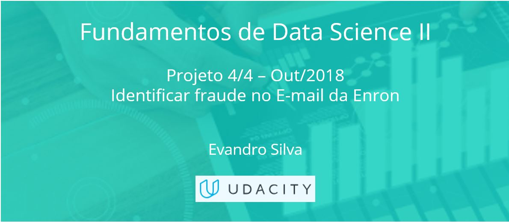

### Nanodegree - Fundamentos de Data Science II - Projeto 4 de 4 (UDACITY)

#### Projeto/Necessidade de negócio: 
- Def_Proj - Identificar fraude no Email da Enron.pdf

#### Entrega: 
- Report - Identificar fraude no Email da Enron.html
- Analisando o resultado de testes AB.ipynb

#### Avaliação do cliente:
 - Udacity Reviews.pdf 
 - Udacity Code Reviews.pdf 